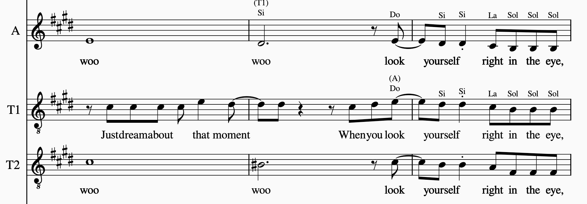
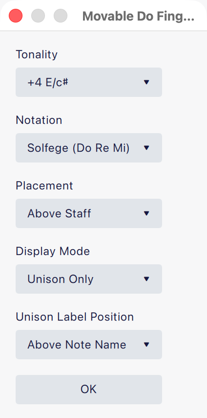

# Movable Do Fingering

[English](./README.md) | [繁體中文（台灣）](./README.zh-TW.md)

Movable Do Fingering 是一個 [MuseScore](https://musescore.org/) 外掛，基於 [nozomu-y/MovableDo](https://github.com/nozomu-y/MovableDo) 修改而來。  
它會依照調性把首調唱名加到樂譜上，並且以指法文字（fingering text）輸出（不是五線譜文字）。

> ⚠️ **本分支僅支援 MuseScore 4.4 以上版本。**  
> 若你使用 MuseScore 4.3 或更早版本，請改用 `main` 分支。

## 功能特色

- 以指法文字加入首調唱名。
- 支援四種記譜樣式：
  - `Letters-vowel`（`Do -> d`、`♯Do -> di`、`♭Ti -> ta`）
  - `Letters`（`Do -> d`、`♯Do -> ♯d`、`♭Ti -> ♭t`）
  - `Numeric`（`Do -> 1`、`Re -> 2`，升降記號保留）
  - `Solfege (Do Re Mi)`（`Do`、`Re`、`Mi`...）
- 支援標示在譜表上方或下方。
- 支援顯示模式：
  - `All Notes`（全部音符）
  - `Unison Only`（只顯示與其他譜表同音高的音，並在後面附上聲部名稱）
- 在 `Unison Only` 下，可設定同音聲部註記位置：
  - `Above Note Name`（顯示在音名上方）
  - `Below Note Name`（顯示在音名下方）
- 開啟對話框時，會依目前調號自動推測調性。
- 會記住你上次使用的記譜樣式、位置與顯示模式。

## 安裝方式

1. 下載此專案 ZIP（或直接 clone）。
2. 將檔案放到 MuseScore 使用者的 `Plugins` 資料夾。
3. 重新啟動 MuseScore。
4. 開啟 **Plugins Manager**，啟用 **Movable Do Fingering**。

## 使用方式

從 **Plugins → Composing/Arranging Tools → Movable Do Fingering** 執行外掛。

1. 設定 **Tonality**、**Notation**、**Placement**、**Display Mode**、**Unison Label Position**。
2. 按下 **OK** 套用。

行為說明：

- 若有選取**區間（range）**，只會處理該區間。
- 若未選取區間，會處理整份總譜。
- 不會自動刪除既有的指法文字，若要重套請先清除舊標示。

## 與 nozomu-y/MovableDo 的差異

- 更新為 MuseScore 4.4+ 外掛與對話框中繼資料格式。
- 介面文字改為英文並調整用語。
- 新增 `Letters`、`Numeric`、`Solfege` 三種樣式。
- 調性下拉選單重新整理，閱讀更直觀。
- 新增依調號自動推測調性的功能。
- 新增對話框設定記憶功能。
- 改為輸出**指法文字**（非五線譜文字）。
- 新增同音（Unison）偵測模式與聲部名稱附註。
